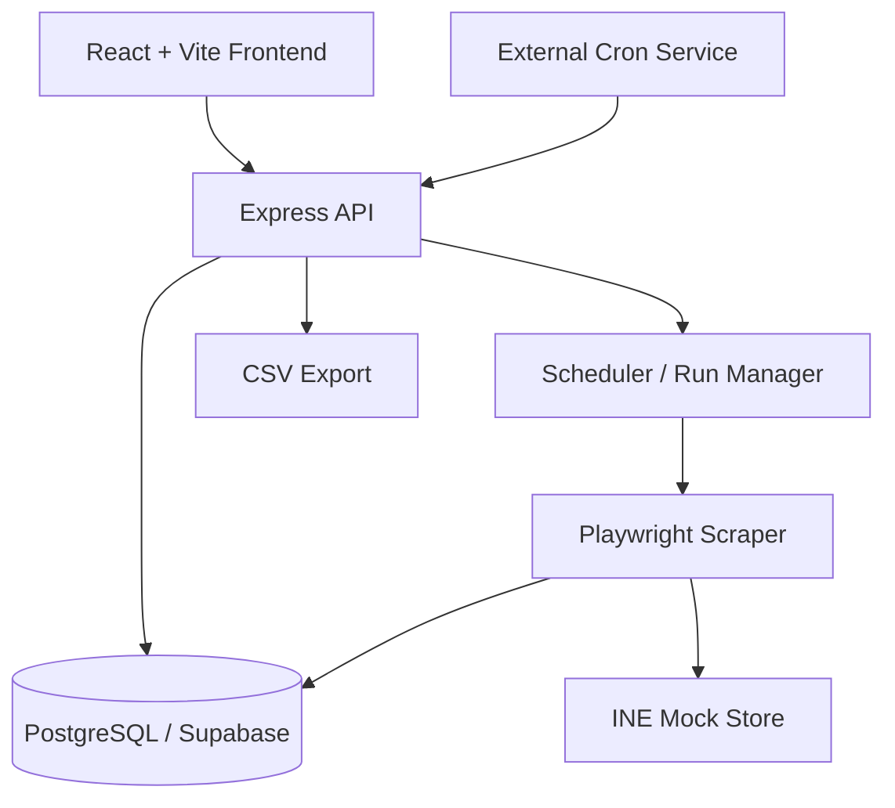

# INE Product Price Tracker

## Overview

INE Product Price Tracker is a full-stack monitoring application for the INE mock store. It allows users to search products, select a store product and option, persist the selection, and scrape live price and stock data on a fixed schedule. The app stores price and stock history, records scrape attempts, exposes analytics, and supports CSV export of the stored attempt history.

The repository contains both the frontend dashboard and the backend scraper/worker stack. The backend is designed to run on Render, the frontend is intended for Vercel, and the database is PostgreSQL managed through Supabase.

## Live Demo

- Frontend: Not specified in the repository docs; intended for Vercel.
- Backend API: https://pricepulse-bgxj.onrender.com
- GitHub: Not specified in the repository docs.
- Demo Recording: Not included in the repository; must be recorded locally in headed mode.
- INE Mock Store: https://demo.inelabteamdev.com/

## Assignment Requirements

| Requirement | Implementation | Status |
|---|---|---|
| Product search by partial/full name | Catalog search and product matching logic | Implemented |
| Select a product | Product catalogue and detail pages | Implemented |
| Select a product option/variant | Option selection in product detail/tracking flow | Implemented |
| Persist tracked product and option | PostgreSQL-backed tracked product storage | Implemented |
| Scrape price and stock on 2-hour schedule | Default 120-minute interval, slot-aligned schedule | Implemented |
| Display price history | Historical observations are shown for tracked options | Implemented |
| Display stock history | Stock changes are included in historical observations | Implemented |
| Log every scrape attempt | Attempt records are stored in the database | Implemented |
| Distinguish success / retried / failed | Outcome states are recorded by attempt | Implemented |
| Record failed attempts honestly | Failed attempts do not store successful values | Implemented |
| Handle slow responses, retries and recovery | Playwright + retry logic handle timeouts and recovery | Implemented |
| At least 2-3 tracked products in the dashboard | Production notes record multiple tracked products | Implemented |
| CSV export one row per attempt | CSV export is implemented server-side | Implemented |
| CSV includes ID, product name, option, timestamp, price, stock, outcome | Export fields are included in route and CSV generation | Implemented |
| Failed CSV rows have empty price and stock | CSV output preserves blank fields for failed attempts | Implemented |
| Headed scraper mode exists | `--headed` mode is available in the scraper CLI | Implemented |
| 2-4 min headed recording | Recording is a local artifact; repo includes the process and command | Ready to record |
| Frontend intended for Vercel | Frontend config and docs target Vercel | Implemented |
| Backend intended for Render | Docker + Render deployment notes exist | Implemented |
| Supabase Postgres used | Deployment notes and config match Supabase PostgreSQL | Implemented |
| Scheduling through external cron | Deployment notes describe cron-job.org and wake jobs | Implemented |
| Scrape only INE mock store | Config enforces INE store host and rejects other hosts | Implemented |

## Features

### User-facing product features
- Search the product catalogue by product name.
- Browse the available products in the mock store.
- Select a store product and an option variant before tracking.
- Track a product and keep it persisted in the database.
- View current price, stock, and recent price movement in the dashboard.

### Monitoring features
- Scrape the selected product option on a fixed schedule.
- Record price and stock history for tracked options.
- Show price history and stock history for each tracked product.
- Display relevant dashboard KPIs and analytics for tracked items.
- Show all scrape attempts and outcomes in the log view.

### Reliability features
- Distinguish success, retried and failed states.
- Handle slow page responses and pending states.
- Re-check price states before accepting a result.
- Keep failed attempts honest and avoid storing incorrect successful values.
- Validate quote provenance against the requested product and option.

### CSV export
- Export a CSV of every scrape attempt.
- Include the product ID from the store URL, name, selected option, UTC timestamp, price, stock, and outcome.
- Leave price and stock blank whenever an attempt failed.

## Architecture



## Repository layout

```text
INE/
├── apps/
│   ├── frontend/        # React dashboard
│   └── server/          # Express API, scraper, scheduler, database logic
├── docs/
│   └── AI_LOG.md        # implementation debugging and correction notes
├── packages/
│   └── shared/
├── package.json
├── pnpm-workspace.yaml
├── turbo.json
├── README.md
├── pnpm-lock.yaml
└── vercel.json
```

## Implementation notes

### Frontend
- Vite + React + TypeScript dashboard in `INE/apps/frontend`
- Product search, product detail pages, tracked products, logs, analytics, and settings modules
- API integration through typed API modules and React Query hooks

### Backend
- Express app and route structure in `INE/apps/server/src`
- Database repositories for products, tracked products, runs, attempts, alerts, and layout versions
- Schedule alignment and run orchestration logic in the scheduler modules
- Server-side CSV export in the export route and CSV utility

### Scraper
- Playwright-based page automation in `INE/apps/server/src/scraper`
- Retry logic and slow-response handling in `retry.js`
- Page-state validation and layout checks in `layout.js`
- Price and stock parsing in `parser.js`
- Store API access in `store.js`

### Database
- PostgreSQL schema and migrations live under `INE/apps/server/db/migrations`
- Tracks products, attempts, runs, and metadata required for scheduling and history
- Project docs explicitly reference Supabase PostgreSQL in production

## Deployment and scheduling

The repository includes explicit deployment and scheduling documentation:

- Frontend is intended for Vercel
- Backend is intended for Render
- Database is Supabase PostgreSQL
- Scheduling is done with an external cron service because free-tier backends can sleep
- The backend uses a wake job and a scrape job to keep the service alive and scheduled

The actual notes are recorded in `INE/apps/server/docs/deployment-notes.md`.

## Headed scraper demo

The repository includes headed scraper mode for a local browser recording:

```bash
cd INE/apps/server
pnpm scrape -- --product 2179 --option o1 --headed
```

This is the supported local mode to produce the required 2-4 minute screen capture showing the scraper handling slow or failing responses against the INE mock store.

## Documentation in the repo

- `INE/README.md` — high-level workspace documentation
- `INE/apps/frontend/README.md` — frontend docs
- `INE/apps/server/README.md` — backend, scraper, and schedule documentation
- `INE/apps/server/docs/deployment-notes.md` — deployment and cron behavior notes
- `INE/apps/server/docs/store-notes.md` — store behavior and scrape assumptions
- `INE/docs/AI_LOG.md` — implementation history and correction of first-pass AI-generated mistakes

## Final note

This README intentionally documents only what exists in the repository and what is verified in the implementation, deployment notes, and tests. It avoids invented endpoints, unsupported claims, or undocumented deployment assumptions.
